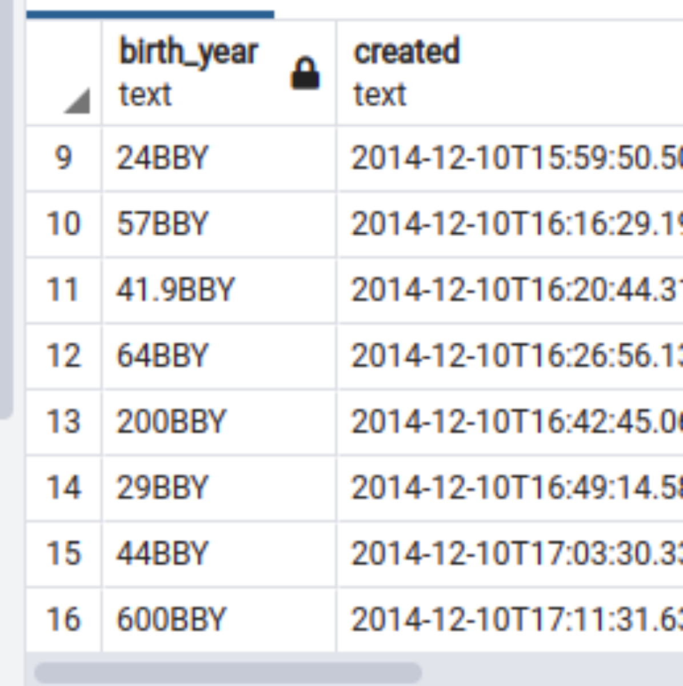

# starwar-calender-converter
Every line of codes has a story behind it just like every poetry line was inspired by certain events.

Not a fan of Star War (heard about it but never watch or read any meaniful things). But As aspiring Data Engineer, I was working on a project that required consuming dataset from an API hosted at https://swapi.dev/api/  (That is sn open API dedicated to all about Star War, so, you can grab data for your learning over there!).

Hence, as part of Transformation processing stage, it was required that, Actor age or (as the problem state, 'find the oldest actor') should be derived.

If you look at this image  (the data after Extraction/Ingestation State)


You will see that date_birth was in format
 45BBY
 32ABY
 etc.

 To understand this Date format, you should see this https://starwars.fandom.com/wiki/Battle_of_Yavin

 But, the simple interpreatation is that, an event, which was known as 'Battle of Yavin', was EPOCH. And all events are reference according to this battle.

 So, 78BBY means 78 years before the Battle of Yavin while
 78ABY means 78 years After the Battle of Yavin  

This library was inspired by the needs to parse and convert 'date_birth' in Star war datasets made available at https://swapi.dev/api/ into human readable format

**** In case of Alien Invasion from Star War, we need a quick way to parsed DOB of such alien, and this python module is doing that. 


See following Url:
1. https://swapi.dev/api/people/
2. https://starwars.fandom.com/wiki/Battle_of_Yavin
3. https://starwars.fandom.com/wiki/0_BBY


# Versioning
⋅⋅1 starwar-dob 3.14.post0   Released: Mar 19, 2022

# INSTALLATION
Get it by running this python in your working environment
'pip install starwar-dob==3.14.post0'

# USAGE

```python

from starwardob import starwardob

actor = starwardob.StarwarDOB('3Aby')
print(actor.unix_year)'          # Actor DOB in UNIX format (1970) is display
print(actor.age)'                # Actor age is dispay in human readable format
```


# BUG TRACKING
Join us at https://github.com/blueband/starwar-calender-converter/issues